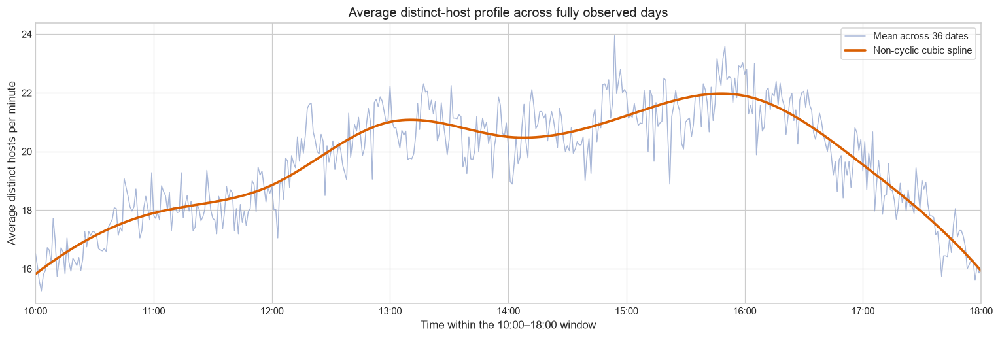
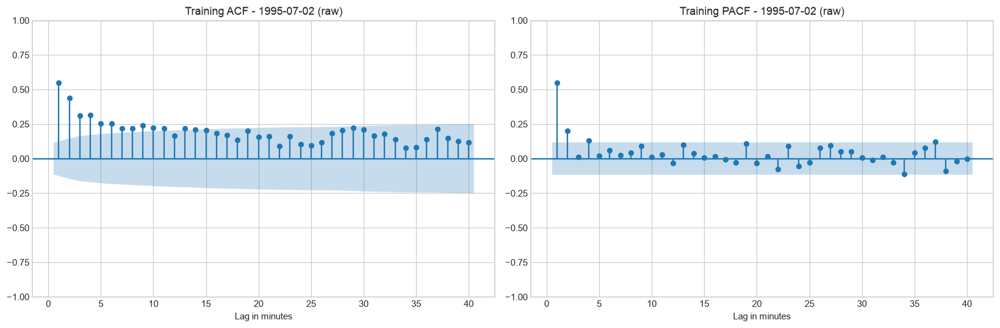
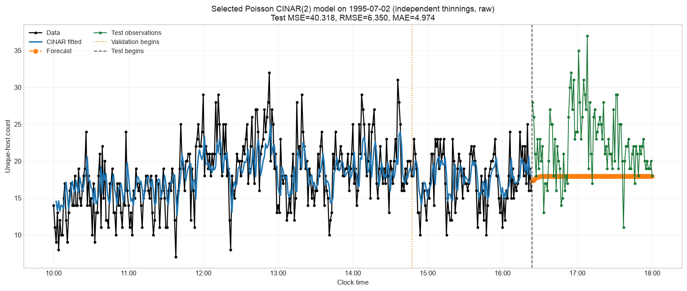

# NASA HTTP Count Time Series with Poisson CINAR(p)

This project builds, diagnoses, and forecasts minute-level count time series from the NASA Kennedy Space Center HTTP logs using **Poisson Combined Integer-Valued Autoregressive models**, or **CINAR(p)** models.

The response is the number of distinct host identifiers observed by the server in each minute. The repository contains the complete workflow:

- stream and aggregate the July-August 1995 NASA HTTP logs;
- construct complete daily 10:00-18:00 count series;
- estimate and remove the common intraday seasonal pattern;
- inspect count distributions, stationarity, ACF, and PACF;
- fit Poisson CINAR(p) models with independent or identical thinning;
- select the order and thinning structure using validation forecasts;
- evaluate the selected model on an untouched test block; and
- save fitted parameters and train/validation/test metrics as JSON.

## Data

The raw data are the public NASA HTTP access logs for July and August 1995. A log record provides a host identifier, timestamp, HTTP request, response status, and response size.

For minute $t$, let $B_t$ be the set of parsed requests and let $h(r)$ be the host recorded in request $r$. The modeled count is

$$
Y_t = \left|\{h(r):r\in B_t\}\right|,
$$

the number of distinct host strings observed during that minute. A host is counted at most once per minute, even if it makes multiple requests.

The analysis uses the inclusive daily window

$$
10{:}00,10{:}01,\ldots,17{:}59,18{:}00,
$$

which contains

$$
8\times60+1=481
$$

observations per day. A date is retained only if all 481 server-log minutes are present. This produces:

- **36 complete daily windows**;
- **17,316 minute-level observations**; and
- separate time series for each date, with no artificial lag connecting one day to the next.

The host field is an identifier, not a verified person: multiple people can share an address, and one person can appear under multiple addresses.

## Intraday seasonality

Let $Y_{d,m}$ be the distinct-host count on date $d$ at within-day minute $m\in\{1,\ldots,481\}$. The cross-day minute average is

$$
\overline{Y}_m=\frac{1}{D}\sum_{d=1}^{D}Y_{d,m},
\qquad D=36.
$$

A regular, non-cyclic cubic spline is fitted to these 481 averages. It is deliberately non-cyclic because 18:00 is not adjacent to 10:00 in the observed data.



If the fitted spline is $\widehat{s}_m$, its overall reference level and centered seasonal component are

$$
\overline{s}=\frac{1}{481}\sum_{m=1}^{481}\widehat{s}_m,
\qquad
\widehat{c}_m=\widehat{s}_m-\overline{s}.
$$

The continuous seasonally adjusted series is

$$
Z_{d,m}=Y_{d,m}-\widehat{c}_m.
$$

Because an INAR response must be a nonnegative integer, the exploratory count-valued version is

$$
Z^{\mathrm{int}}_{d,m} = \max\left\{0,\operatorname{round}(Z_{d,m})\right\}.
$$

Both the original and integer-adjusted counts are retained, so model selection can be run with or without the estimated intraday seasonal component.

## Poisson CINAR(p) model

The model follows Weiß (2008):

$$
X_t
=
\sum_{i=1}^{p}
D_{t,i}\left(\alpha\circ X_{t-i}\right)
+\varepsilon_t.
$$

The components are:

$$
(D_{t,1},\ldots,D_{t,p})
\sim
\operatorname{Multinomial}(1;\phi_1,\ldots,\phi_p),
$$

where

$$
\phi_i\ge 0,
\qquad
\sum_{i=1}^{p}\phi_i=1,
$$

and Poisson innovations

$$
\varepsilon_t\sim\operatorname{Poisson}(\lambda_\varepsilon).
$$

The binomial thinning operator is

$$
\alpha\circ X
=
\sum_{j=1}^{X}B_j,
\qquad
B_j\overset{\mathrm{i.i.d.}}{\sim}\operatorname{Bernoulli}(\alpha),
$$

so that

$$
\alpha\circ X\mid X=x
\sim
\operatorname{Binomial}(x,\alpha).
$$

At every time step, one of the previous $p$ observations is selected according to $\boldsymbol\phi$, thinned, and combined with a new Poisson innovation.

For a stationary process, the marginal mean is

$$
\mu_X=\frac{\lambda_\varepsilon}{1-\alpha}.
$$

### Independent thinning

Every later use of an observation receives a newly sampled binomial thinning result. The conditional transition probability is

$$
\Pr(X_t=x_t\mid\mathcal F_{t-1})
=
\sum_{i=1}^{p}\phi_i
\sum_{y=0}^{\min(x_t,x_{t-i})}
\operatorname{Bin}(y;x_{t-i},\alpha)
\operatorname{Pois}(x_t-y;\lambda_\varepsilon).
$$

Its conditional expectation is

$$
E(X_t\mid\mathcal F_{t-1})
=
\lambda_\varepsilon
+\alpha\sum_{i=1}^{p}\phi_iX_{t-i}.
$$

### Identical thinning

Each observation $X_s$ receives one latent thinning result

$$
Z_s\mid X_s=x_s\sim\operatorname{Binomial}(x_s,\alpha),
$$

and that same $Z_s$ is reused whenever $X_s$ is selected as a lag later. This sharing creates additional dependence between future observations.

The implementation evaluates the exact conditional likelihood with a latent-state filter over

$$
(Z_{t-p},\ldots,Z_{t-1}).
$$

For latent state $z$, the observation factor is

$$
g_t(z)
=
\sum_{i=1}^{p}
\phi_i
\operatorname{Pois}(x_t-z_{t-i};\lambda_\varepsilon).
$$

The filter multiplies the current state probabilities by $g_t(z)$, normalizes them, removes the oldest latent thinning, and introduces $Z_t\mid X_t$. This is more computationally expensive than independent thinning, especially for large counts or large $p$.

## Estimation

`PoissonCINARp.fit()` uses conditional maximum likelihood. For observations $x_0,\ldots,x_{n-1}$, it maximizes

$$
\ell(\theta)
=
\sum_{t=p}^{n-1}
\log\Pr_\theta(X_t=x_t\mid\mathcal F_{t-1}),
$$

conditional on the first $p$ observations.

The parameter restrictions are enforced through transformations:

$$
\alpha=\frac{1}{1+e^{-\eta_\alpha}},
\qquad
\lambda_\varepsilon=e^{\eta_\lambda},
$$

and a softmax transformation for $\boldsymbol\phi$. Since only $p-1$ lag probabilities are free, the model has

$$
k=p+1
$$

estimated parameters. The optimizer uses several correlation-informed starting points and L-BFGS-B minimization of the negative log-likelihood.

The fitted model reports

$$
\operatorname{AIC}=2k-2\widehat\ell,
$$

$$
\operatorname{BIC}=k\log(n-p)-2\widehat\ell,
$$

and one-step in-sample mean squared error

$$
\operatorname{MSE}
=
\frac{1}{n-p}
\sum_{t=p}^{n-1}(x_t-\widehat{x}_t)^2.
$$

## Model-selection workflow

For a chosen date and dataset version, observations are split chronologically into:

- 60% training;
- 20% validation; and
- the remaining 20% test data.

The split is never randomized. The training ACF and PACF are calculated before fitting candidate models. Significant short PACF lags define the candidate orders, subject to a configurable maximum order.



Every combination of candidate $p$ and thinning operator is fitted using training data only. Each candidate produces a recursive forecast across the complete validation block and is ranked by validation MSE:

$$
\operatorname{MSE}_{\mathrm{validation}}
=
\frac{1}{n_v}
\sum_{h=1}^{n_v}
\left(x_{T+h}-\widehat{x}_{T+h\mid T}\right)^2.
$$

The selected specification is refitted on training plus validation observations and evaluated once on the untouched test block. In addition to MSE, the notebooks report

$$
\operatorname{RMSE}=\sqrt{\operatorname{MSE}}
$$

and

$$
\operatorname{MAE}
=
\frac{1}{n}
\sum_{t=1}^{n}|x_t-\widehat{x}_t|.
$$

## Default example

The executed model-selection notebook uses 2 July 1995, the original counts, candidate orders $p\in\{1,2\}$, and both thinning structures.

The validation procedure selected a **Poisson CINAR(2) model with independent thinning**. After refitting on training plus validation data, its estimates were:

| Parameter | Estimate |
|---|---:|
| $\widehat\alpha$ | 0.5529 |
| $\widehat\lambda_\varepsilon$ | 8.0321 |
| $\widehat\mu_X$ | 17.9664 |
| $\widehat\phi_1$ | 0.7257 |
| $\widehat\phi_2$ | 0.2743 |
| Development AIC | 2095.03 |
| Development BIC | 2106.87 |

The split-specific forecast metrics were:

| Split | Observations | MSE | RMSE | MAE |
|---|---:|---:|---:|---:|
| Train | 286 | 14.847 | 3.853 | 3.036 |
| Validation | 96 | 13.670 | 3.697 | 3.063 |
| Test | 97 | 40.318 | 6.350 | 4.974 |



The test block has a visibly higher count level than the development period. Because a long recursive forecast converges toward the fitted marginal mean, the model underpredicts much of this higher-activity test interval. This is a useful diagnostic result rather than something hidden by selecting on the test data.

## Repository structure

```text
.
├── cinar.py
├── NASA_HTTP_unique_hosts_EDA.ipynb
├── NASA_CINAR_model_selection.ipynb
├── requirements.txt
├── data/
│   ├── NASA_access_log_Jul95.gz
│   ├── NASA_access_log_Aug95.gz
│   ├── NASA_HTTP_minute_10_to_18.csv
│   └── NASA_HTTP_minute_10_to_18_seasonally_adjusted.csv
├── figures/
│   ├── intraday-seasonality.png
│   ├── training-acf-pacf.png
│   └── selected-model-test-forecast.png
└── saved_models/
    └── 1995-07-02.json
```

## Installation

```bash
git clone <repository-url>
cd nasa

python3 -m venv .venv
source .venv/bin/activate
python -m pip install --upgrade pip
python -m pip install -r requirements.txt
```

Use an existing Jupyter frontend, or install JupyterLab separately:

```bash
python -m pip install jupyterlab
jupyter lab
```

## Reproducing the analysis

Run the notebooks in this order:

1. `NASA_HTTP_unique_hosts_EDA.ipynb`
   - parses and aggregates the raw logs;
   - constructs complete daily windows;
   - estimates the intraday seasonal component;
   - exports the original and seasonally adjusted CSV files; and
   - performs distributional, stationarity, ACF, and PACF diagnostics.

2. `NASA_CINAR_model_selection.ipynb`
   - chooses a date and raw or adjusted response;
   - creates the chronological split;
   - selects candidate orders from the training PACF;
   - fits and validates candidate CINAR models;
   - evaluates the selected model on test data; and
   - saves the selected specification and metrics under `saved_models/`.

Configuration variables appear near the top of the model-selection notebook:

```python
CHOSEN_DATE = "1995-07-02"
DATASET_KIND = "raw"  # or "seasonally_adjusted"
THINNING_OPERATORS = ("independent", "identical")
TRAIN_FRACTION = 0.60
VALIDATION_FRACTION = 0.20
ACF_PACF_LAGS = 40
MAX_CANDIDATE_ORDER = 2
```

## Python API

```python
import numpy as np

from cinar import PoissonCINARp

train = np.array([4, 3, 5, 6, 4, 7, 5, 4, 6, 8, 5, 7])

model = PoissonCINARp(
    p=2,
    thinning_operator="independent",
).fit(train)

print(model.parameters_)
print(model.metrics_)

forecast = model.predict(train, n_steps=10)
figure, axis = model.plot(train, n_steps=10)
```

The model exposes:

- `alpha_`;
- `innovation_mean_`;
- `marginal_mean_`;
- `phi_`;
- `log_likelihood_`;
- `aic_`, `bic_`, and `mse_`;
- `fitted_values_` and `residuals_`; and
- `optimization_result_`.

`save_model()` writes a day-named JSON file containing the model specification, fitted parameters, fit statistics, and separate train/validation/test metrics.

## Limitations

- The model uses a conditional likelihood and does not include the stationary joint probability of the first $p$ observations.
- Exact identical-thinning filtering can grow rapidly in memory and runtime as $p$ and the counts increase.
- The integer seasonal adjustment is a pragmatic exploratory transformation; a formal nonstationary count model could instead include the seasonal mean as a time-varying component.
- Recursive long-horizon forecasts tend toward the fitted marginal mean and cannot anticipate a future level shift without additional information.
- A unique host string is not equivalent to a unique person.

## References and data source

- Weiß, C. H. (2008). *The combined INAR(p) models for time series of counts*. Statistics & Probability Letters, 78, 1817-1822. [https://doi.org/10.1016/j.spl.2008.01.036](https://doi.org/10.1016/j.spl.2008.01.036)
- NASA Kennedy Space Center HTTP logs, Internet Traffic Archive: [https://ita.ee.lbl.gov/html/contrib/NASA-HTTP.html](https://ita.ee.lbl.gov/html/contrib/NASA-HTTP.html)
